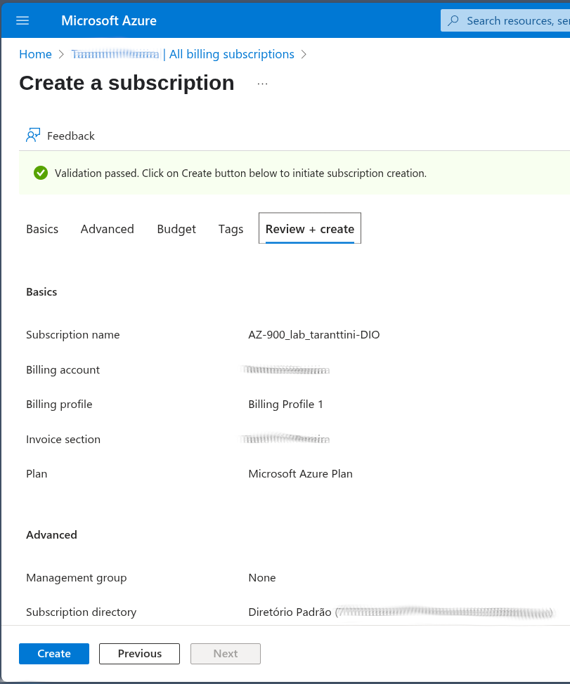
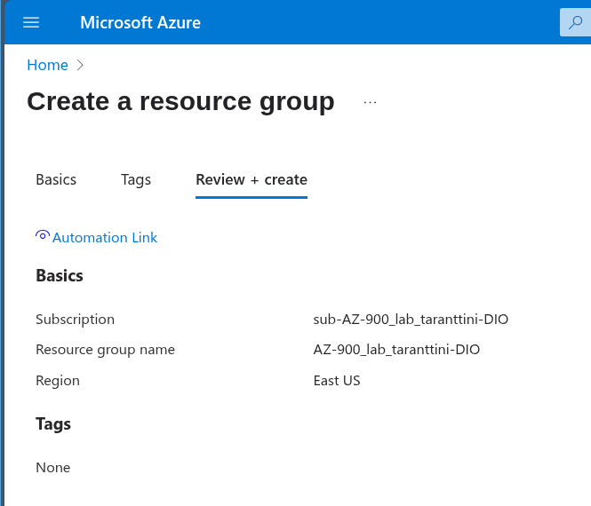
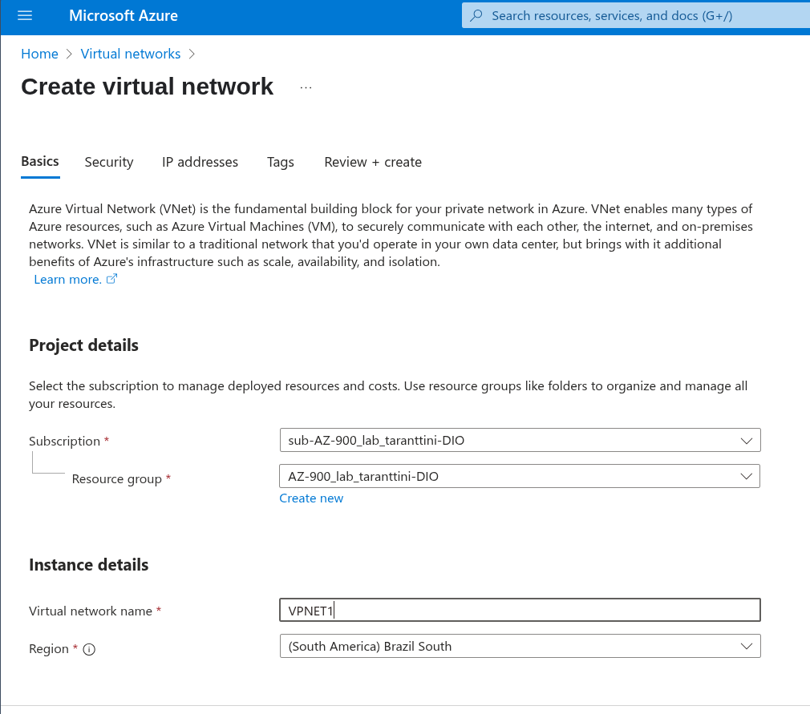
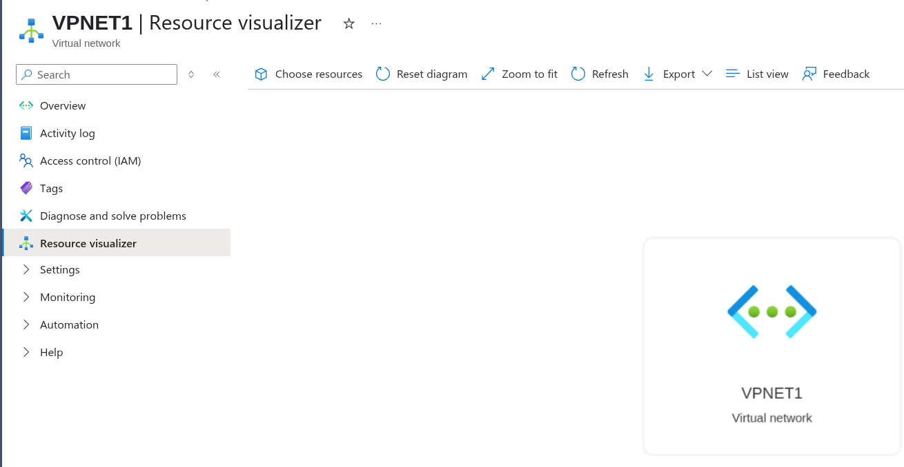
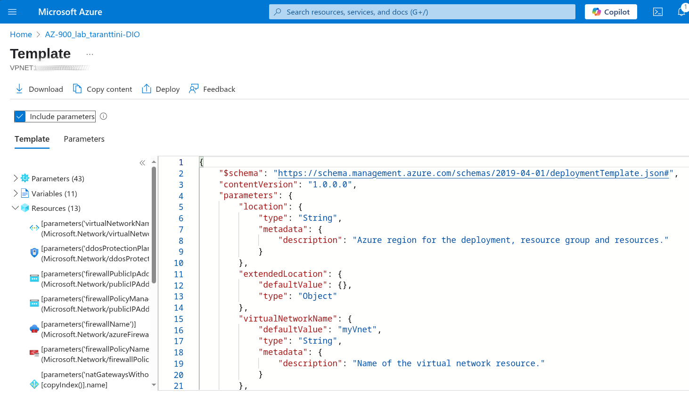

# Criando Recursos na Azure

Realizando procedimentos para documentar a criação de alguns itens dentro da azure

- Criando Subscrição:

- Visualizando Subscrição Criada:

- Criando um Grupo de Recurso

- Criando uma Rede Virtual

- Visualizando os Recursos de Rede Virtual

- Visualizando o Template do Deploy

Esse documento foi criado para realizar a comprovação da tarefa, azure do curso da DIO
