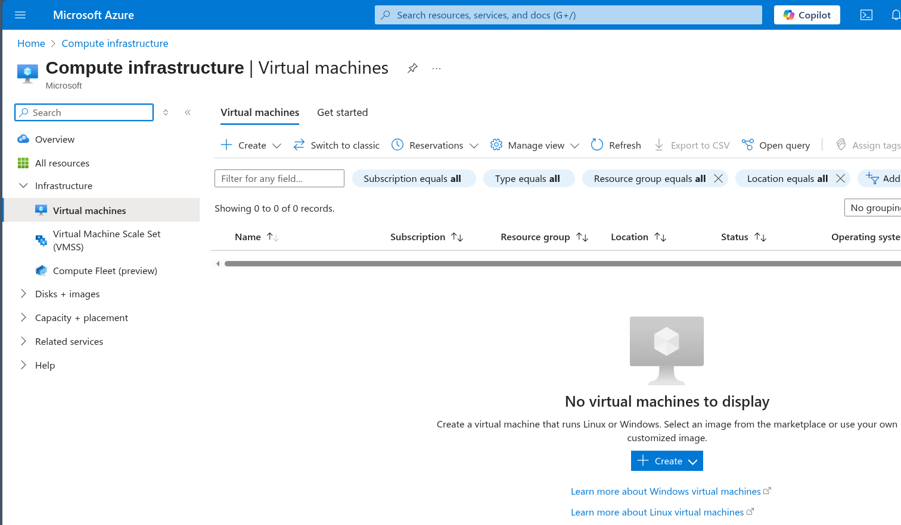

# Criando Recursos na Azure

Realizando procedimentos para documentar a criação de alguns itens dentro da azure

**Criação de Maquina Virtual**

**Configurando o Tipo de Região/SO/Arquitetura**

**Configurando o Disco**

**Configurando o Network**

**Configurando Opção de Desligamento Automático**

Bom para evitar custos fora do período comercial

**Configurando o Alertas**

Bom para evitar surpresas no planejamento dos custos

**Revisando as Configurações Selecionadas**

