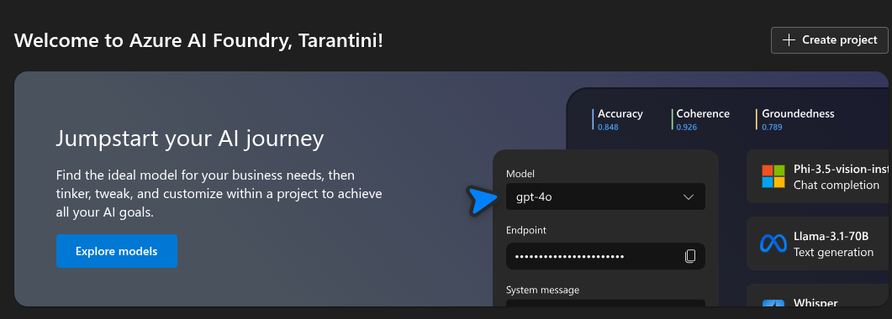
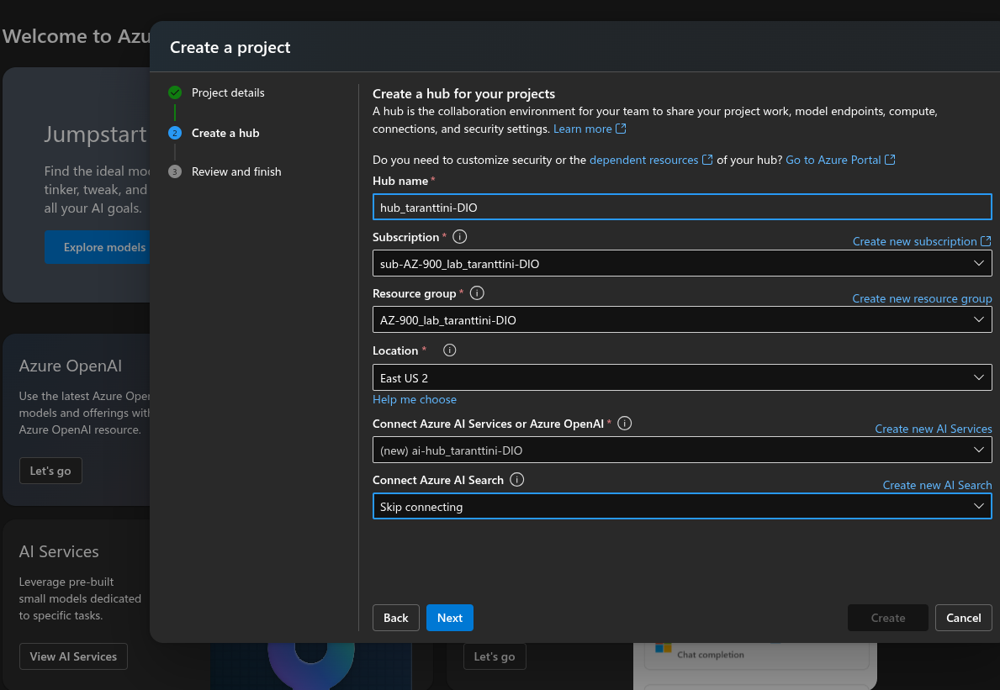
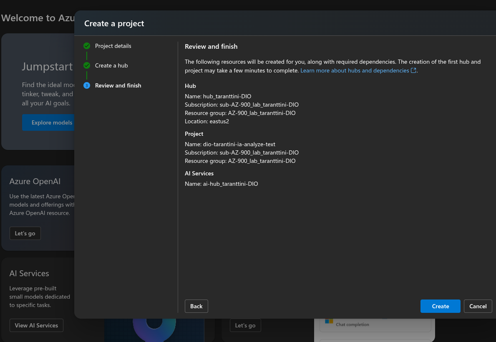
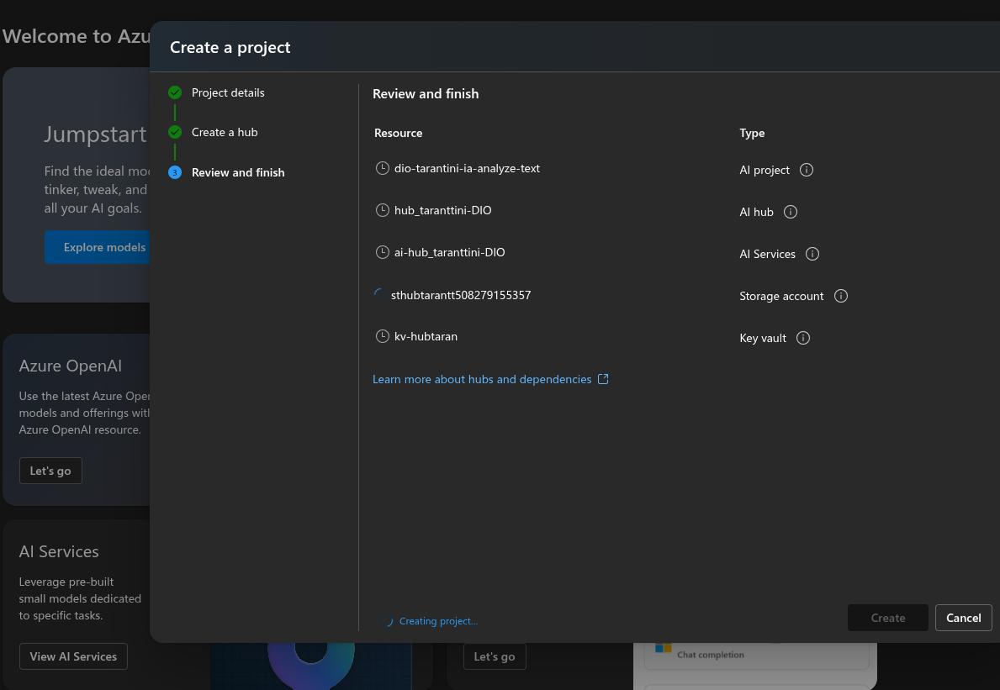
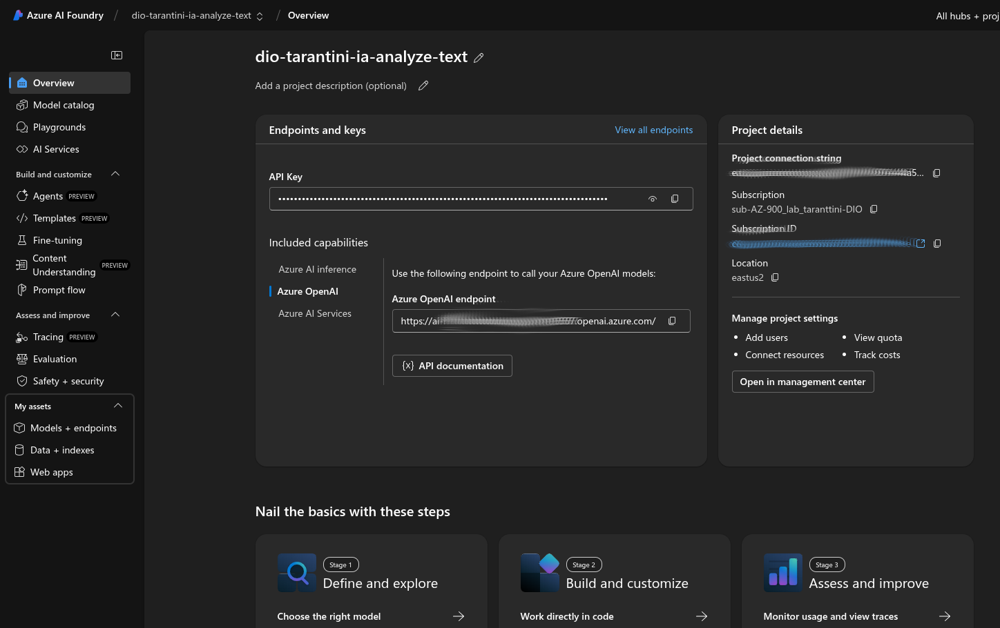
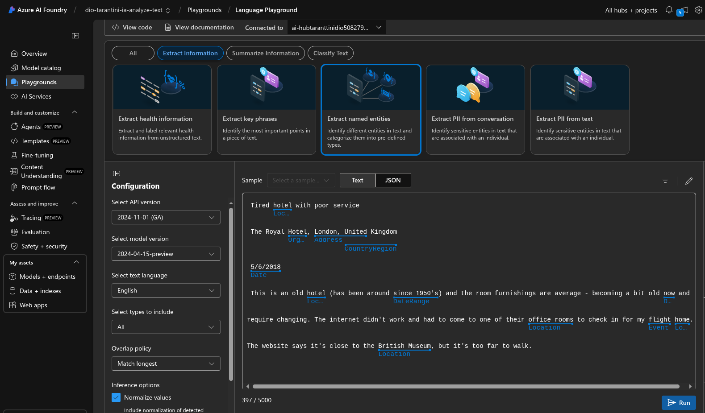
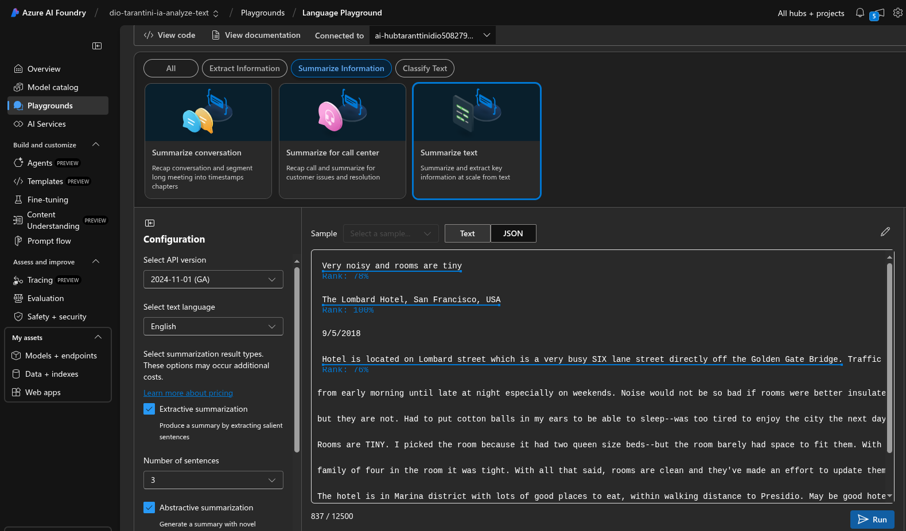

# Criando Recursos na Azure

Realizando procedimentos para documentar a criação de alguns itens dentro da azure

**Tela do IA Foundry**

**Configurando o Projeto/Hub de IA**

**Visualizando Configurações**

**Processo de Criação...**

**Vizualizando as configurações**

**Testando Extract Information**

**Testando Sumarize Text**

