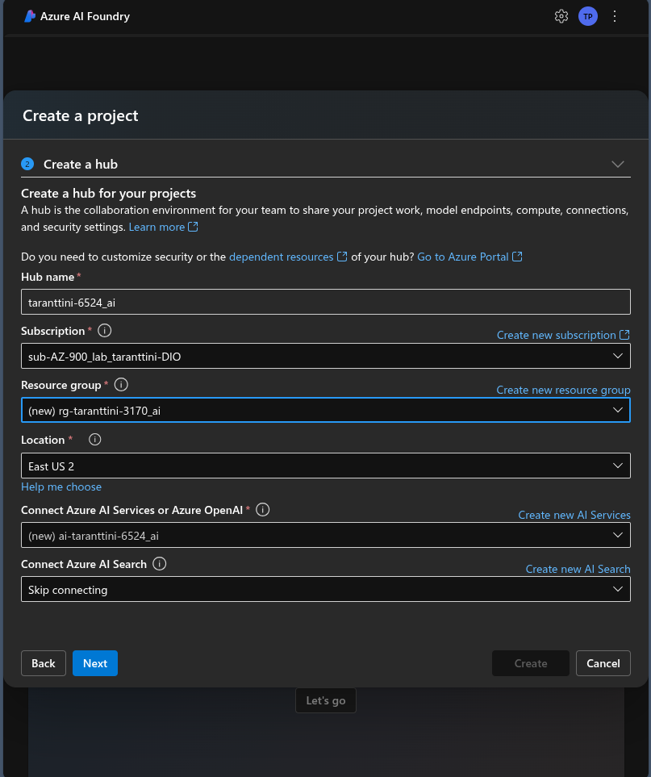
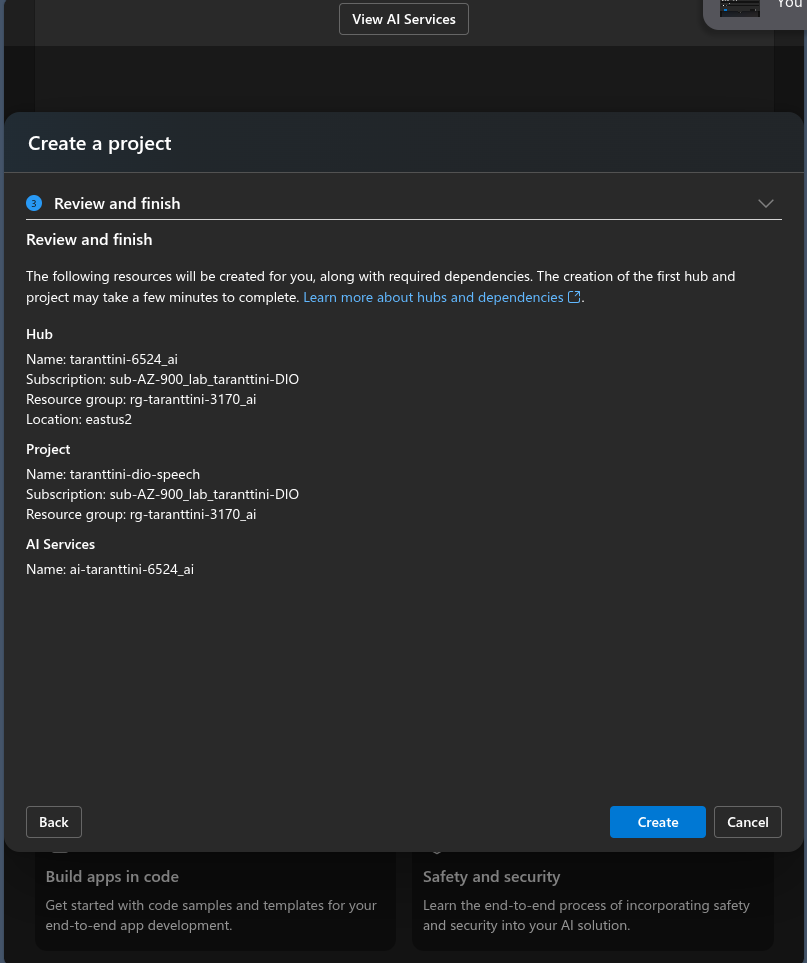
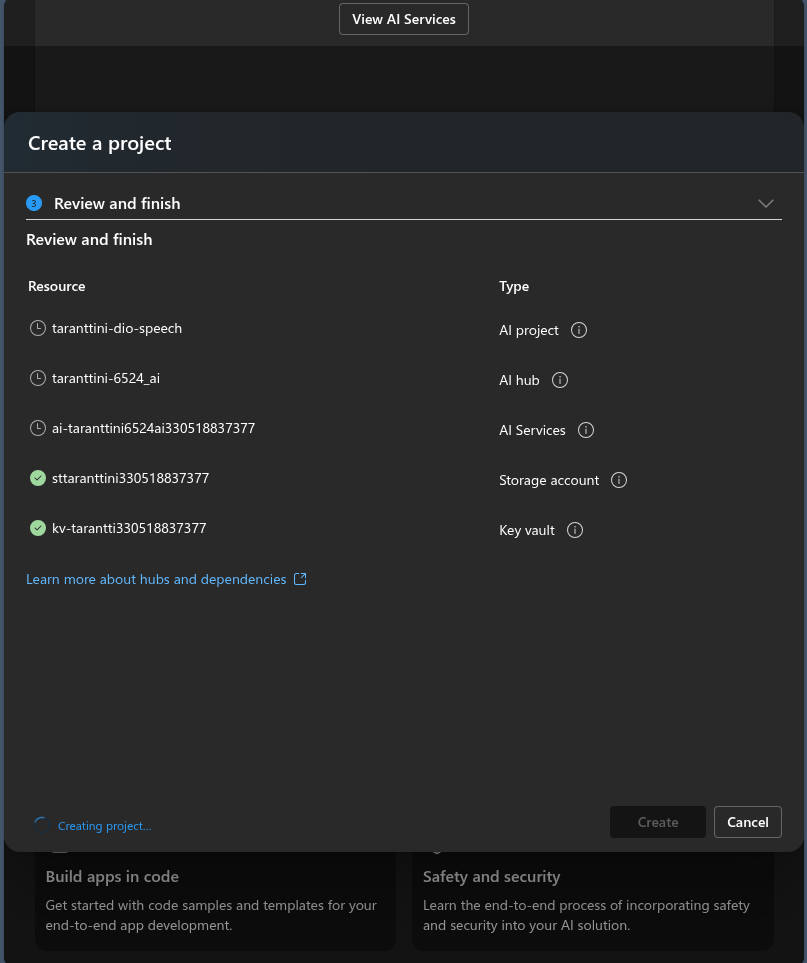
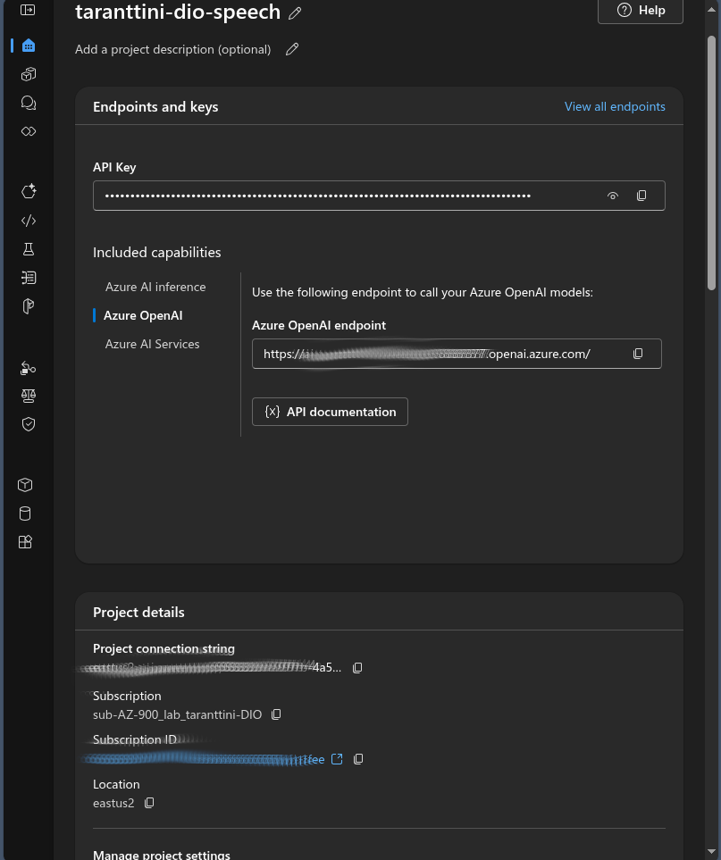
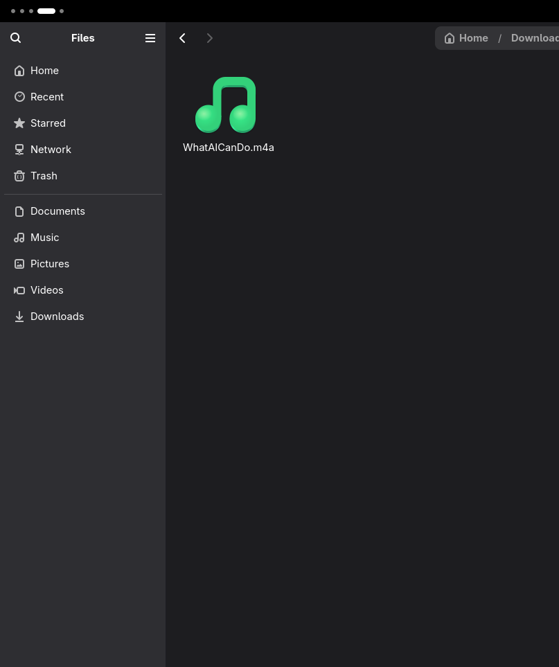
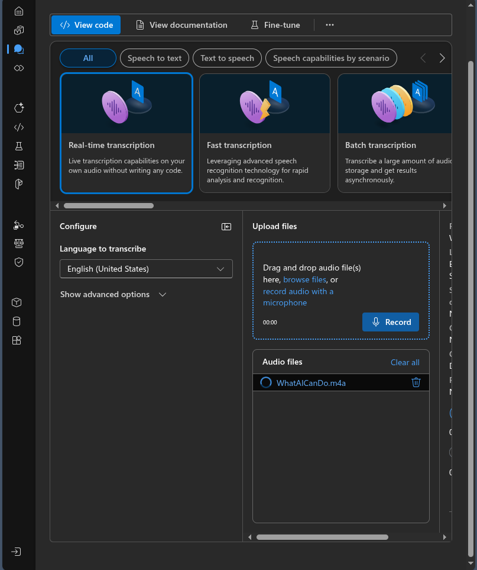
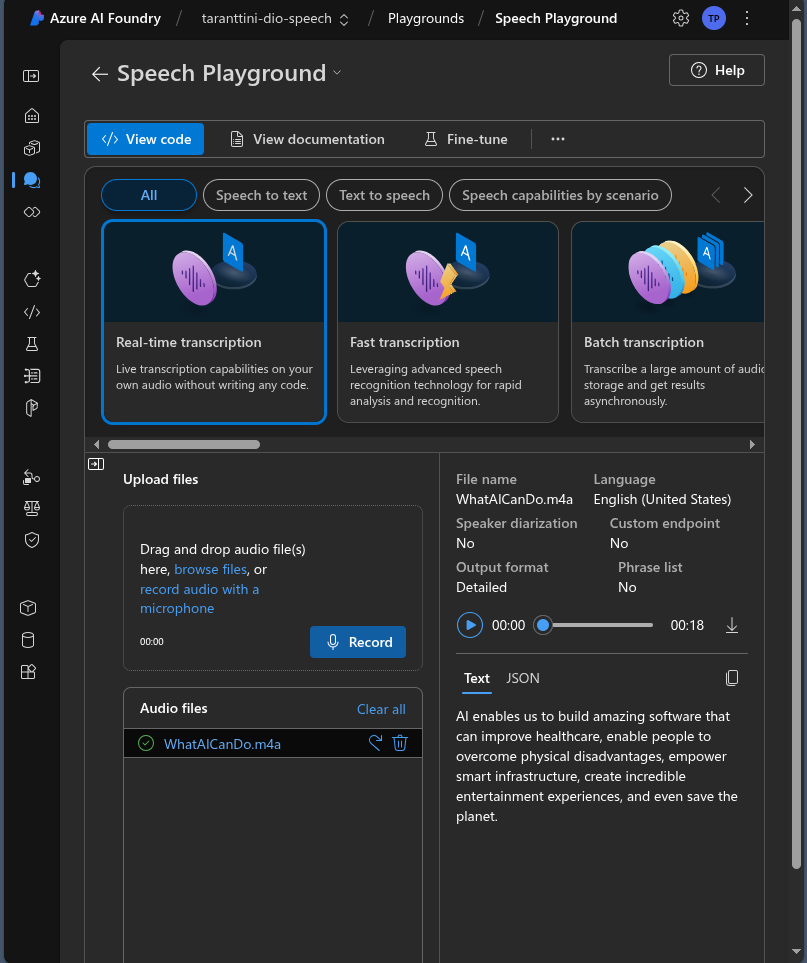

# Criando Recursos na Azure

Realizando procedimentos para documentar a criação de alguns itens dentro da azure

**Configurando o Projeto/Hub de IA**

**Visualizando Configurações**

**Processo de Criação...**

**Vizualizando as configurações**

**Audio do Download**

**Processando Arquivo**

**Resultado do Arquivo**

