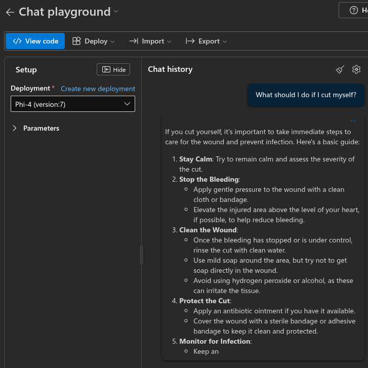

# Criando Recursos na Azure

Realizando procedimentos para documentar a criação de alguns itens dentro da azure

**xxx**

**xxx**

**xxx**

**xxx**

**xxx**

**xxx**

**xxx**

**xxx**

**xxx**

**xxx**

**xxx**

**xxx**

**xxx**

**xxx**

**xxx**

**xxx**

**xxx**

**xxx**

**xxx**

**xxx**

**xxx**

**xxx**

**xxx**

**xxx**

**xxx**

**xxx**

**xxx**

**xxx**

**xxx**

**xxx**

**xxx**

**xxx**

**xxx**

**xxx**

**xxx**

**xxx**

**xxx**

**xxx**

**xxx**

**xxx**

**xxx**

**xxx**

**xxx**

**xxx**

**xxx**

**xxx**

**xxx**

**xxx**

**xxx**

**xxx**

**xxx**

