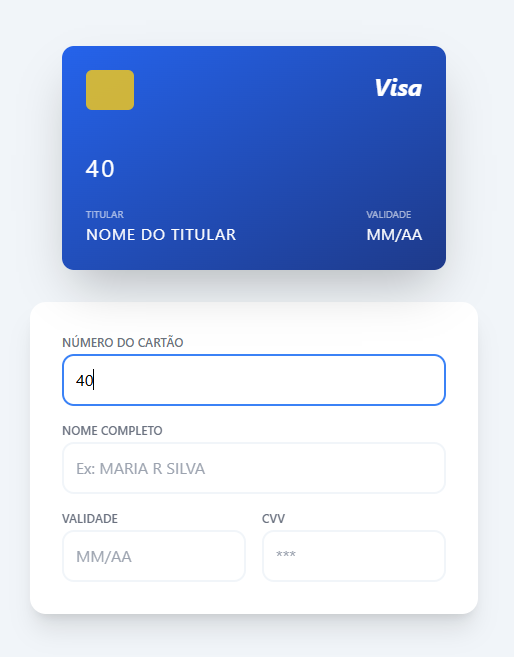
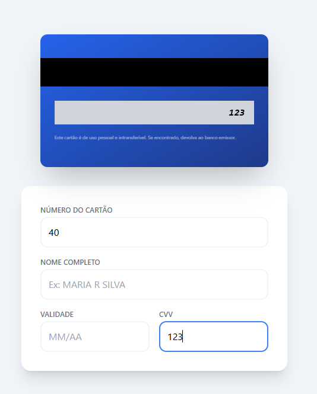

# 💳 Cartão de Crédito Interativo

Um componente de interface de usuário (UI) moderno para preenchimento de dados de cartão de crédito, com validação de bandeira em tempo real e animações 3D.

## ✨ Funcionalidades

- **Visualização Dinâmica:** Os dados digitados no formulário aparecem instantaneamente no cartão.
- **Detecção de Bandeira:** - Começa com '4': **Visa**
  - Começa com '51' a '55': **Mastercard**
- **Animação Flip:** O cartão vira automaticamente para o verso quando o usuário foca no campo de CVV.
- **Máscaras de Input:** Formatação automática para o número do cartão (#### ####) e validade (MM/AA).

## 🛠️ Tecnologias Utilizadas

- **HTML5**
- **Tailwind CSS**: Utilizado para estilização responsiva e controle de perspectiva 3D.
- **JavaScript Vanilla**: Lógica de manipulação de string e eventos de interface.

## 🚀 Como Executar

1. Clone o repositório ou baixe os arquivos.
2. Abra o arquivo `index.html` em qualquer navegador moderno.
3. Certifique-se de estar conectado à internet para carregar o Tailwind via CDN.

## 📂 Estrutura de Arquivos

- `index.html`: Estrutura e estilos específicos de animação.
- `script.js`: Lógica de detecção de bandeira e controle do DOM.

### 🎨 Estilização Dinâmica
O projeto utiliza um sistema de classes dinâmicas para alterar a identidade visual do cartão:
- **Visa**: Degradê linear `blue-600` para `blue-900`.
- **Mastercard**: Degradê linear `red-600` para `yellow-500`.
- **Amex**: Degradê linear `slate-100` para `zinc-400`.
- **Elo**: Degradê linear `zinc-300` para `slate-950`.
- **Dinners**: Degradê linear `emerald-500` para `teal-700`.
- **Cielo**: Degradê linear `sky-400` para `blue-600`.
- **Default**: Degradê neutro em tons de cinza escuro.

### GUIA

O proposito do desafio era utilizar o copilot, mas acabei fazendo uma mescla de copilot, cursor e gemini

| Frente do Cartão | Verso do Cartão | 
| -- | -- |
|  |  |

