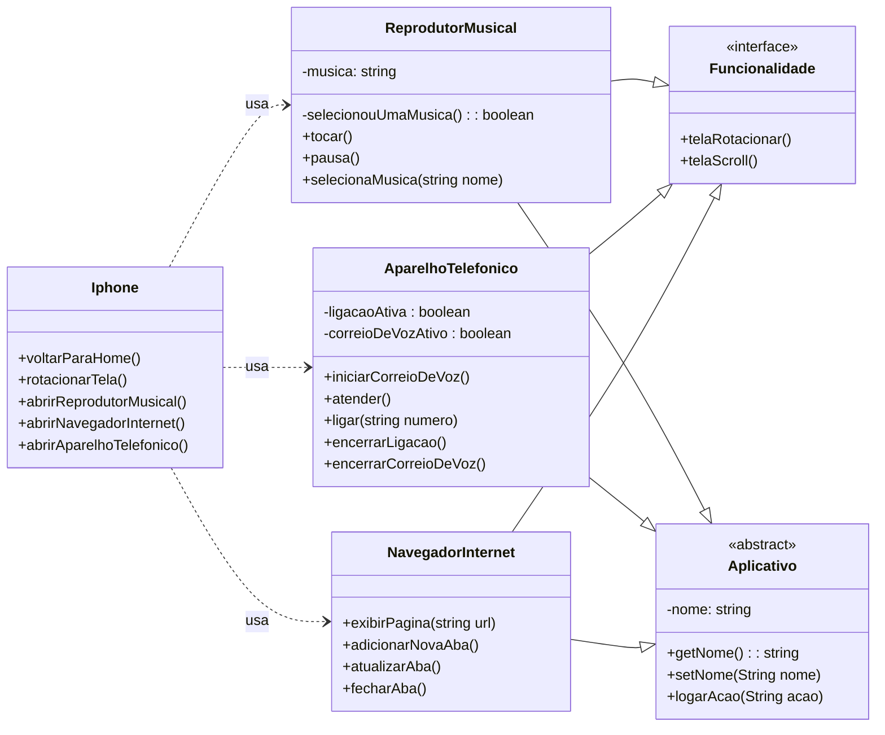

# Solução

O código está localizado na pasta iPhone, e execução do programa está na classe `Programa.java`

Info: Segue a solução da atividade em formato diagrama Mermaid

***OBS**: Segue imagem, caso não seja visível no modelo Mermaid*

