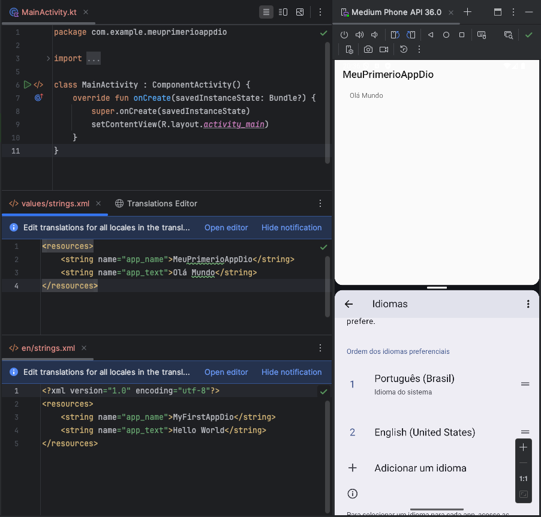

# meu-primeiro-app-dio

Esse arquivo tem apenas o intuito de documentar as telas do desafio DIO

Criar um aplicativo **default** de Android, e utilizar os recursos de internacionalizar o APP, e assim exibir em outros idiomas basedo no idioma do sistema.

## App com o idioma em português

## App com o idioma em inglês

